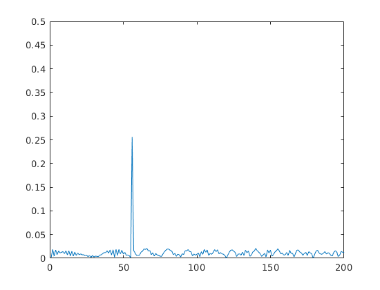
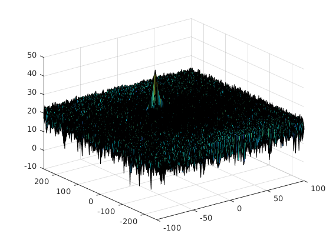
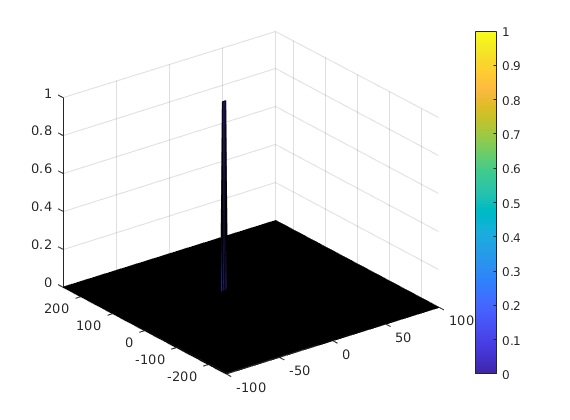

# SFND: Radar Target Generation and Detection


* Configure the FMCW waveform based on the system requirements.
* Define the range and velocity of target and simulate its displacement.
* For the same simulation loop process the transmit and receive signal to determine the beat signal
* Perform Range FFT on the received signal to determine the Range
* Towards the end, perform the CFAR processing on the output of 2nd FFT to display the target.

## 1 - Configure the FMCW Waveform

The sweep bandwidth can be determined according to the range resolution and the sweep slope is calculated using both sweep bandwidth and sweep time.

```
B = c/(2*rangeResolution);
```

The sweep time can be computed based on the time needed for the signal to travel the unambiguous maximum range. In general, for an FMCW radar system, the sweep time should be at least 5 to 6 times the round trip time. This example uses a factor of 5.5.


```
rrtScale = 5.5;
Tchirp = rrtScale*(2*maxRange/c);
slope = B/Tchirp;
```

## 2 - Define the range and velocity of target and simulate its displacement.

According to the requirements that the max range cannot exceed 200 m and velocity can be within [-70, 70] m/s, the designed initial range and velocity are as follows,

```
R0 = 110;
v = -20;
```

Considering the velocity would be constant here, we can simulate the range at time t as,

```
R = R0 + v*t；
```

## 3 - Determine the beat signal

In terms of wave equation, FMCW transmit and received signals are defined using these wave equations, where `alpha = Slope of the signal`. The Transmit Signal is given by:

```
Tx(i) = cos(2*pi*(fc*t(i) + (slope*t(i)^2)/2));
```

The received signal is nothing but the time delayed version of the Transmit Signal. In digital signal processing the time delayed version is defined by `tau` represents the delay time, which in radar processing is the trip time for the signal, `tau = R/c;`.


Replacing t with (t−tau) gives the Receive Signal:

```
Rx(i) = cos(2*pi*(fc*(t(i)-tau) + (slope*(t(i)-tau)^2)/2));
```

On mixing these two signals, we get the beat signal, which holds the values for both range as well as doppler. By implementing the 2D FFT on this beat signal, we can extract both Range and Doppler information.

The beat signal can be calculated by multiplying the Transmit signal with Receive signal. This process in turn works as frequency subtraction.

```
Mix(i) = Tx(i)*Rx(i);
```

## Apply Range FFT (First FFT)

Implement the 1D FFT on the Mixed Signal.

1. Reshape the vector into Nr*Nd array.

```
beat = reshape(Mix, [Nr, Nd]);
```

2. Run the FFT on the beat signal along the range bins dimension (Nr) and Normalize the FFT output.

```
signal_fft = fft(beat)/Nr;
```

3. Take the absolute value of that output.

```
signal_fft = abs(signal_fft);
```

4. Keep one half of the signal

```
signal_fft = signal_fft(1:Nr/2);
```

Plot the output as shown in the below figure. The peak indicates the the initial position of the target.



## Perform the Doppler FFT (2nd FFT) and generate the Range Doppler Response

This part has been provided as below,

```
% Range Doppler Map Generation.

% The output of the 2D FFT is an image that has reponse in the range and
% doppler FFT bins. So, it is important to convert the axis from bin sizes
% to range and doppler based on their Max values.

Mix = reshape(Mix, [Nr, Nd]);

% 2D FFT using the FFT size for both dimensions.
sig_fft2 = fft2(Mix, Nr, Nd);

% Taking just one side of signal from Range dimension.
sig_fft2 = sig_fft2(1:Nr/2, 1:Nd);
sig_fft2 = fftshift(sig_fft2);
RDM = abs(sig_fft2);
RDM = 10*log10(RDM) ;

% use the surf function to plot the output of 2DFFT and to show axis in both
% dimensions
doppler_axis = linspace(-100, 100, Nd);
range_axis = linspace(-200, 200, Nr/2)*((Nr/2)/400);
figure('Name', 'Range Doppler response');
surf(doppler_axis, range_axis, RDM);
```

The output RDM is as below,



## Apply CA-CFAR

1. Determine the number of Training cells for each dimension. Similarly, pick the number of guard cells.

```
% Select the number of Training Cells in both the dimensions.

Tr = 12; % Training (range dimension)
Td = 3; % Training cells (doppler dimension)

% Select the number of Guard Cells in both dimensions around the Cell under
% test (CUT) for accurate estimation

Gr = 4; % Guard cells (range dimension)
Gd = 1; % Guard cells (doppler dimension)
```

2. Slide the cell under test across the complete matrix. Make sure the CUT has margin for Training and Guard cells from the edges.

3. For every iteration sum the signal level within all the training cells. To sum convert the value from logarithmic to linear using db2pow function.

```
s1 = sum(db2pow(RDM(i:i+2*Tr+2*Gr, j:j+2*Td+2*Gd)), 'all');
s2 = sum(db2pow(RDM(i+Tr:i+Tr+2*Gr, j+Td:j+Td+2*Gd)), 'all');
noise_level = s1 - s2;
```

4. Average the summed values for all of the training cells used. After averaging convert it back to logarithmic using pow2db.

```
threshold = noise_level/num_cells;
threshold = pow2db(threshold);
```

5. Further add the offset to it to determine the threshold.

```
threshold = threshold+offset;
```

6. Next, compare the signal under CUT against this threshold. If the CUT level > threshold assign it a value of 1, else equate it to 0.

```
signal = RDM(i+Tr+Gr, j+Td+Gd);

if signal < threshold
    signal = 0;
else
    signal = 1;
end

signal_cfar(i+Tr+Gr, j+Td+Gd) = signal;
```

The filtered signal after performing CA-CFAR is as below,


